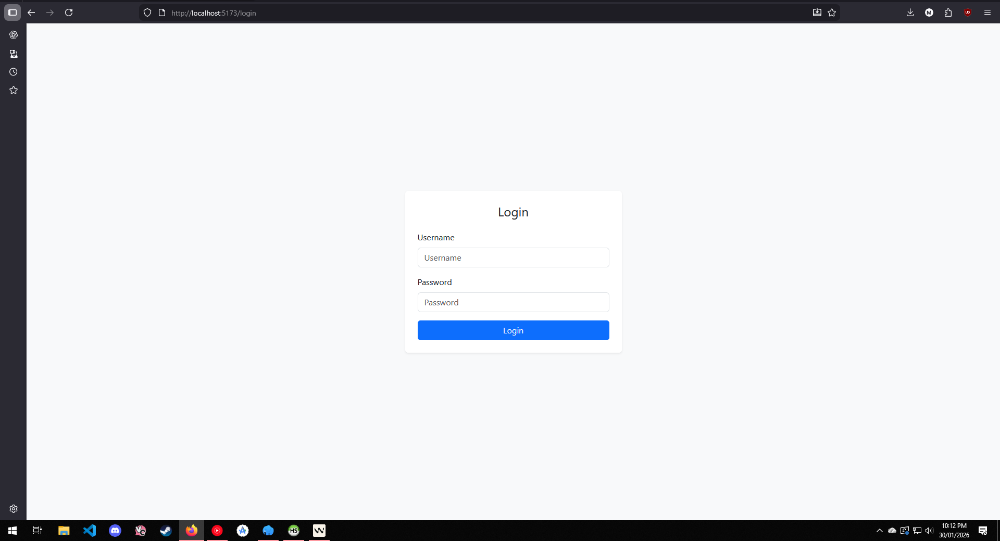
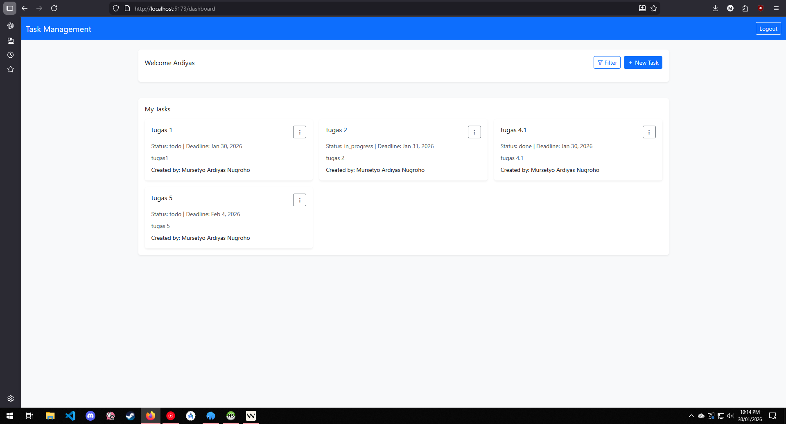
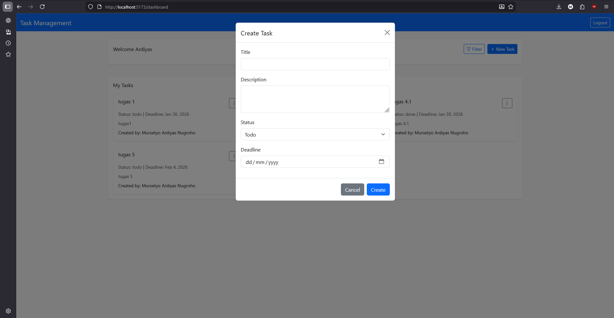

# Task Management System
Aplikasi manajemen tugas berbasis web dengan fitur CRUD (Create, Read, Update, Delete) untuk mengelola task secara personal. 


Aplikasi ini dibangun dengan arsitektur backend Laravel dan frontend Vue.js.


# Fitur Utama
- Authentication - Login dan logout dengan JWT token
- Task Management - Buat, baca, update, dan hapus task
- Filter & Search - Filter berdasarkan status dan deadline
- Responsive Design - Tampilan yang optimal di desktop dan mobile
- Real-time Updates - Perubahan langsung terlihat tanpa refresh
# Teknologi yang Digunakan
- Backend
- Laravel 12.0 - PHP Framework
- Laravel MySQL - Database
- JWT Auth - Authentication system
- PHP 8.2+ - Runtime
- Frontend
- Vue 3 - JavaScript Framework
- Vue Router - Client-side routing
- Axios - HTTP Client
- Bootstrap 5 - CSS Framework
- Vite - Build Tool
# Persyaratan Sistem
- PHP 8.2 atau lebih tinggi
- Composer
- Node.js 18+ dan npm
- Docker
- MySQL/MariaDB
- Git
# Langkah Instalasi


1. Clone Repository


bash


git clone <repository-url>


cd task-management


2. Setup Backend


bash


cd backend

 
### Install dependencies
composer install
 
### Copy environment file
cp .env.example .env
 
### Generate application key
php artisan key:generate
 
### Setup database di .env
DB_CONNECTION=mysql


DB_HOST=127.0.0.1


DB_PORT=3306


DB_DATABASE=task-management


DB_USERNAME=root


DB_PASSWORD=

 
### Run migration
php artisan migrate
 
### Start development server
php artisan serve
 
### Setup Frontend
bash


cd frontend
 
### Install dependencies
npm install
 
### Start development server
npm run dev

### Akses Aplikasi
Frontend: http://localhost:5173 


Backend API: http://localhost:8000


# Informasi Login Dummy
Gunakan akun berikut untuk login:


Username: Ardiyan,Ardiyas


Password: diyan123,diyas123


atau menggunakan endpoint register


http://localhost:8000/register

# Struktur Database
Users Table


sql


- user_id (Primary Key)
- username
- email
- password (hashed)
- created_at
- updated_at


Tasks Table


sql
- task_id (Primary Key)
- user_id (Foreign Key)
- title (varchar 25)
- description (text)
- status (enum: todo, in_progress, done)
- deadline (date)
- created_by (varchar 25)
- created_at
- updated_at
## Relationship
Users memiliki banyak Tasks (One-to-Many)


Tasks dimiliki oleh satu User (Many-to-One)

# Tampilan Utama




## Docker Setup
 
### Development
```bash
# Clone dan setup
git clone <repository-url>
cd task-management
 
# Jalankan dengan Docker
docker-compose up -d --build
# terkadang dependency backend terlihat error,namun di docker berjalan 
 
# Akses aplikasi
# Frontend: http://localhost:5173
# Backend: http://localhost:8000

Production
bash
# Setup production
docker-compose -f docker-compose.prod.yaml up -d --build
 
# Akses aplikasi
# http://localhost (dengan nginx)
Docker Commands
bash
# Lihat status
docker-compose ps
 
# Lihat logs
docker-compose logs -f
 
# Stop services
docker-compose down
 
# Rebuild
docker-compose up -d --build